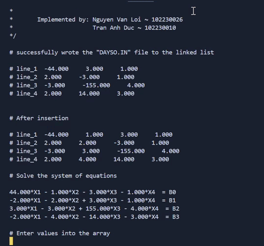
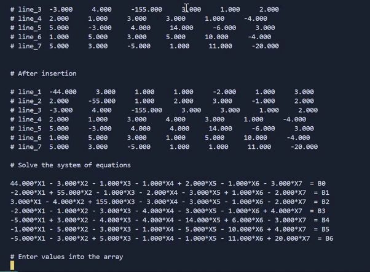

 

# PBL_1
- PBL_1: COMPUTATIONAL PROGRAMMING
- Topic : [305](./src/Danh%20sach%20de%20tai%20PBL_1.pdf)
- Instructor: Pham Cong Thang
- Implemented by: 
  * Nguyen Van Loi ~ 102230026
  * Tran Anh Duc ~ 102230010

## Overview of the program

# PBL_1
- PBL_1: Lập trình tính toán
- Chủ đề : [305](./src/Danh%20sach%20de%20tai%20PBL_1.pdf)
- Giáo viên hướng dẫn : Nguyễn Công Thắng
- Sinh viên thực hiện: 
  * Nguyễn Văn Lợi ~ 102230026
  * Trần Anh Đức ~ 102230010

## TỔNG QUANG VỀ CHƯƠNG TRÌNH

## YÊU CẦU 1
- Sử dụng dang sách liên kết đơn.
- a Đọc vào N danh sách liên kết từ file DAYSO.IN.
*   (Gợi ý: trong file DAYSO.IN gồm 𝑁 hàng (N>=5), mỗi hàng gồm M phần tử số, M=N-1. Mỗi hàng này tương ứng là một danh sách ). 

## YÊU CẦU 2
- b Thực hiện thêm thêm vào mỗi danh sách liên kết một phần tử tại vị trí M/2 (có
làm tròn nếu M lẻ), hiển thị kết quả và lưu kết quả ra file RESULT1.OUT.

## YÊU CẦU 3 
- Sau khi thực các **Bước** trên thì ta thu được ma trận **A**.
- Nhập vào mảng 1 chiều với ta thu được B.
- Hãy tìm nghiệm X của hệ phương trình AX = B **bằng phương pháp giảm dư**.

## DỮ LIỆU ĐẦU VÀO 
- File *DAYSO.IN*.

## DỮ LIỆU ĐẦU RA
- File *RESULT1.OUT, RESULT2.OUT*.

